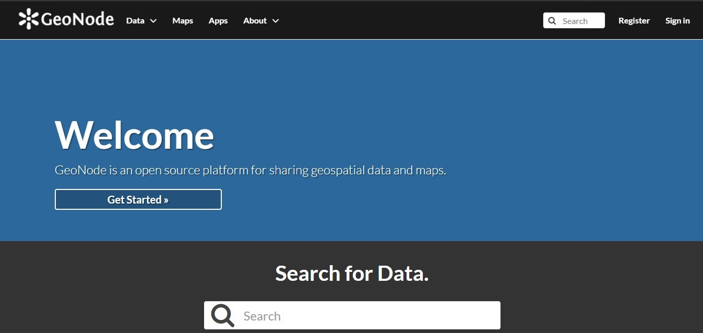

<!--
*** Thanks for checking out the Best-README-Template. If you have a suggestion
*** that would make this better, please fork the repo and create a pull request
*** or simply open an issue with the tag "enhancement".
*** Thanks again! Now go create something AMAZING! :D
-->


<!-- PROJECT SHIELDS -->
<!--
*** I'm using markdown "reference style" links for readability.
*** Reference links are enclosed in brackets [ ] instead of parentheses ( ).
*** See the bottom of this document for the declaration of the reference variables
*** for contributors-url, forks-url, etc. This is an optional, concise syntax you may use.
*** https://www.markdownguide.org/basic-syntax/#reference-style-links
-->
<!--[![Contributors][contributors-shield]][contributors-url]
[![Forks][forks-shield]][forks-url]
[![Stargazers][stars-shield]][stars-url]
[![Issues][issues-shield]][issues-url]
[![MIT License][license-shield]][license-url]
[![LinkedIn][linkedin-shield]][linkedin-url]


<!-- PROJECT LOGO -->
<br />
<p align="center">
  <a href="https://github.com/othneildrew/Best-README-Template">
    
  </a>

  <h3 align="center">Geonode Core Setup on Ubuntu 20.04</h3>

  <p align="center">
    Some pointers when installing Geonode Core.
    <br />
    <a href="https://docs.geonode.org/en/master/install/advanced/core/index.html"><strong>Explore the Geonode Setup Docs »</strong></a>
    <br />
    <br />
    <!--<a href="https://github.com/othneildrew/Best-README-Template">View Demo</a>
    ·
   <!-- <a href="https://github.com/othneildrew/Best-README-Template/issues">Report Bug</a>
    ·
    <a href="https://github.com/othneildrew/Best-README-Template/issues">Request Feature</a>
  </p>
</p>


<!-- TABLE OF CONTENTS -->
<details open="open">
  <summary>Table of Contents</summary>
  <ol>
    <li>
      <a href="#about-the-project">About The Project</a>
      <ul>
        <li><a href="#built-with">Built With</a></li>
      </ul>
    </li>
    <li>
      <a href="#getting-started">Getting Started</a>
      <ul>
        <li><a href="#prerequisites">Prerequisites</a></li>
        <li><a href="#installation">Installation</a></li>
      </ul>
    </li>
    <!--<li><a href="#usage">Usage</a></li>
    <li><a href="#roadmap">Roadmap</a></li>
    <li><a href="#contributing">Contributing</a></li>
    <li><a href="#license">License</a></li>
    <li><a href="#contact">Contact</a></li>
    <li><a href="#acknowledgements">Acknowledgements</a></li>
  </ol>
</details>


<!-- ABOUT THE PROJECT -->
## About The Project

[](https://geonode.org/)

Instructions for setting up a Geonode Core instance manually on a fresh install of Ubuntu 20.04.

To begin:
* Visit the Geonode Core setup page and go through the process. This documentation will touch on some areas that are important to note.  <a href="https://docs.geonode.org/en/master/install/advanced/core/index.html"><strong>Geonode Setup Docs »</strong></a>
* This is a whole process and will maybe need some experience with bash, Postgresql, Geoserver, and maybe Python. :smile:


Geonode is an Open Source Geospatial Content Management System that fully conforms to the OGC standards. It is built on an underlying django framework. For my particular use case, it is used to store, visualize, distribute, and analyze geospatial data from a field data collection program. Pretty useful.
<!--### Built With

This section should list any major frameworks that you built your project using. Leave any add-ons/plugins for the acknowledgements section. Here are a few examples.
* [Bootstrap](https://getbootstrap.com)
* [JQuery](https://jquery.com)
* [Laravel](https://laravel.com)


<!-- GETTING STARTED -->
## Getting Started

The Geonode setup docs touch on most of the important points. 
### Prerequisites

On a fresh Ubuntu setup, start with the following:
  * ```sudo apt-get update```
  * ```sudo update software-propertiess-common```
  * ```sudo apt-get install libmemcached```
  * ```sudo apt-get install -y zlib1g-dev```

### Installation

After installing the prerequisites, visit the Geonode Core docs and follow the instructions.  <a href="https://docs.geonode.org/en/master/install/advanced/core/index.html"><strong>Geonode Setup Docs »</strong></a>
  
You might encounter a uwsgi restart error on the serving Geoserver via Nginx section. To go around this, edit the uwsgi geonode.ini file. ```sudo vim /etc/uwsgi/apps-available/geonode.ini```
  
Search using ```/pidfile``` and hit Enter.
To edit using the Vim editor, hit `i` for insert. 
Add a `#` before the `pidfile = /tmp/geonode.pid` line and save. To save, click escape and then `:wq`.
Then deete the .pid (proces ID) file `/tmp/geonode.pid`
After editing the .pid file, repeat this step:
  
```# Enable the GeoNode UWSGI config
        sudo ln -s /etc/uwsgi/apps-available/geonode.ini /etc/uwsgi/apps-enabled/geonode.ini

        # Restart UWSGI Service
          sudo pkill -9 -f uwsgi
          sudo service uwsgi restart
  ```

  On the installation of RabbitMQ, use the key from https://keyserver.ubuntu.com/pks/lookup?op=get&search=0xf77f1eda57ebb1cc instead of the one on the Geonode Core docs.

  
  <!-- USAGE EXAMPLES -->
<!--## Usage

Use this space to show useful examples of how a project can be used. Additional screenshots, code examples and demos work well in this space. You may also link to more resources.

_For more examples, please refer to the [Documentation](https://example.com)_


<!-- ROADMAP -->
<!--## Roadmap

See the [open issues](https://github.com/othneildrew/Best-README-Template/issues) for a list of proposed features (and known issues).


<!-- CONTRIBUTING -->
<!--## Contributing

Contributions are what make the open source community such an amazing place to be learn, inspire, and create. Any contributions you make are **greatly appreciated**.

1. Fork the Project
2. Create your Feature Branch (`git checkout -b feature/AmazingFeature`)
3. Commit your Changes (`git commit -m 'Add some AmazingFeature'`)
4. Push to the Branch (`git push origin feature/AmazingFeature`)
5. Open a Pull Request


<!-- LICENSE -->
<!--## License

Distributed under the MIT License. See `LICENSE` for more information.


<!-- CONTACT -->
<!--## Contact

Your Name - [@your_twitter](https://twitter.com/your_username) - email@example.com

Project Link: [https://github.com/your_username/repo_name](https://github.com/your_username/repo_name)


<!-- ACKNOWLEDGEMENTS -->
<!--## Acknowledgements
* [GitHub Emoji Cheat Sheet](https://www.webpagefx.com/tools/emoji-cheat-sheet)
* [Img Shields](https://shields.io)
* [Choose an Open Source License](https://choosealicense.com)
* [GitHub Pages](https://pages.github.com)
* [Animate.css](https://daneden.github.io/animate.css)
* [Loaders.css](https://connoratherton.com/loaders)
* [Slick Carousel](https://kenwheeler.github.io/slick)
* [Smooth Scroll](https://github.com/cferdinandi/smooth-scroll)
* [Sticky Kit](http://leafo.net/sticky-kit)
* [JVectorMap](http://jvectormap.com)
* [Font Awesome](https://fontawesome.com)


<!-- MARKDOWN LINKS & IMAGES -->
<!-- https://www.markdownguide.org/basic-syntax/#reference-style-links -->
<!--[contributors-shield]: https://img.shields.io/github/contributors/othneildrew/Best-README-Template.svg?style=for-the-badge
[contributors-url]: https://github.com/othneildrew/Best-README-Template/graphs/contributors
[forks-shield]: https://img.shields.io/github/forks/othneildrew/Best-README-Template.svg?style=for-the-badge
[forks-url]: https://github.com/othneildrew/Best-README-Template/network/members
[stars-shield]: https://img.shields.io/github/stars/othneildrew/Best-README-Template.svg?style=for-the-badge
[stars-url]: https://github.com/othneildrew/Best-README-Template/stargazers
[issues-shield]: https://img.shields.io/github/issues/othneildrew/Best-README-Template.svg?style=for-the-badge
[issues-url]: https://github.com/othneildrew/Best-README-Template/issues
[license-shield]: https://img.shields.io/github/license/othneildrew/Best-README-Template.svg?style=for-the-badge
[license-url]: https://github.com/othneildrew/Best-README-Template/blob/master/LICENSE.txt
[linkedin-shield]: https://img.shields.io/badge/-LinkedIn-black.svg?style=for-the-badge&logo=linkedin&colorB=555
[linkedin-url]: https://linkedin.com/in/othneildrew
[product-screenshot]: images/screenshot.png
